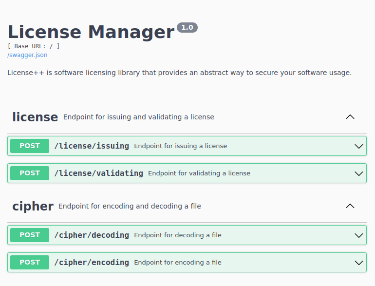

# licensepp-openssl

## Sample `encrypt` function

```python
import lic_manager as lic

idata = lic.P_DATA()
idata.load("raw.bin")
odata = lic.P_DATA()

lic.encrypt(idata, odata)
odata.save("encrypted.bin")
```

## Sample `decrypt` function

```python
import lic_manager as lic

idata = lic.P_DATA()
idata.load("raw.bin")
odata = lic.P_DATA()

lic.decrypt(idata, odata)
odata.save("decrypted.bin")

idata.load("raw.bin")
```

## Sample for issuing license

```python
import lic_manager as lic

lInfo1 = lic.licenseInfo(lic.LICENSEE_SIGNATURE, "EMoi_ltd", "c1-secret-passphrase", "c1", "12th Gen Intel i5-12400F (12) @ 5.600GHz", 87600)
lInfo2 = lic.licenseInfo(lic.LICENSEE_SIGNATURE, "EMoi_ltd", "c2-secret-passphrase", "c2", "NVIDIA GeForce RTX 3060", 78840)
lInfo3 = lic.licenseInfo(lic.LICENSEE_SIGNATURE, "EMoi_ltd", "c3-secret-passphrase", "c3", "B660M Pro RS", 70080)
lInfo4 = lic.licenseInfo(lic.LICENSEE_SIGNATURE, "EMoi_ltd", "c4-secret-passphrase", "c4", "Ubuntu 20.04.4 LTS x86_64", 61320)
lInfo5 = lic.licenseInfo(lic.LICENSEE_SIGNATURE, "EMoi_ltd", "c5-secret-passphrase", "c5", "5.15.0-43-generic", 52560)

license = lic.License()
lic.issuing(lInfo1, license)
lic.showLicenseInfo(license)

r2 = lic.issuing(lInfo2, "c2.lic");
if (r2):
    print("SUCCESS")
else:
    print("FAILED!")
```

## Sample for validating license

```python
import lic_manager as lic

# validate from file
lic_c1 = lic.License()
e = lic.validateFromFile("c1.lic", lic_c1)
if lic.to_int(e.error_code):
    print(e.message)
else:
    print(e.message)

lic.showLicenseInfo(lic_c1)

# validate from decoded base64 string
lic_c2 = lic.License()
e = lic.validate("eyJhZGRpdGlvbmFsX3BheWxvYWQiOiIxMnRoIEdlbiBJbnRlbCBpNS0xMjQwMEYgKDEyKSBAIDUuNjAwR0h6IiwiYXV0aG9yaXR5X3NpZ25hdHVyZSI6IjBGOUQyREI2NjUxNkZGMkFEQUUyNjYzMzk1NUU3ODQ1NDRFRTcyQzcxQkI3OTgzMDM1RkI3Mzk3M0IwMkM2QTZBQjQyODI1OEYyMTcwMDUxRkJFMjFFNTU5OURGODM1QkFERkMxRTg0RjUxN0U5NzkzRUI5QTU1RTI1MURDQkRCRjkzMEFEODFCQTYxQkJBOTZEN0IwNEI5RDU4QTBBMDRBRDg1QzI4MjkyOTcwNjZDRUYzMDA2RDIxMEI0MzBDNTIxRjAyMDkyOEJFQjZGREZGMUY1ODBFQUFDOEYyNzVBODFBRDJBRkRFNjY3MUVBNEU4MkNERTQzQjEzN0M5N0U1QTkyNkJCMDU0NTdDOTNGMDE0MTk2NTAxRTAwNDU0QkExQjFCMzg2RDUzRTgxNTVFQUM0QUUwRUE5QkIzQUI5M0RDNTY1NTZGM0I1RjE0MTk1RTBEOUFBNEM4MTI0RDhFOTQ0MEU1OUU1MTQwQkU5NEVBQjAyMEUzQTIyMTQ1RUFEMkRCN0JENjNCNDcwMTdFMTk5MjM3NzE4NDkzNDVDRjA0RDAzNjQxQTY0M0QzM0EyMEVEMjBCRDBCNzBCMUVCMjlBMDk1MkJCNjM3ODk4OEUzNEJFRTFCOUQ4NzJGNkFEN0Q4MDJGOTEzQzU0MzIxQThFRDc4MzIyNUU3OEM3IiwiZXhwaXJ5X2RhdGUiOjE5OTU0NDg5NjgsImlzc3VlX2RhdGUiOjE2ODAwODg5NjgsImlzc3VpbmdfYXV0aG9yaXR5IjoiYzEiLCJsaWNlbnNlZSI6IkVNb2lfbHRkIiwibGljZW5zZWVfc2lnbmF0dXJlIjoiMzEzMDYyMzUzNTMyMzQzNjYzMzgzODM1MzgzNjYxNjUzNDM4MzIzNzM1MzMzNDM2NjYzODM3NjYzMDYyMzczMjNBNDQzNjcxNkM3MjRDNTg0MjYxNDc2RjM3NTc3NDZCNjc1NTMwMzU2ODdBNEE2MTZENDg0QjQzNEIzOTQ4NzE1OTQ4NDI0QzJCMzE0MjJCNDk3OTUwNDk3NjY5MzYzNzQxNTI3QTc2NTM0NDc0NjY0NDYyNjM3NTc5MkI0OTc0NkIwRDBBMEQwQSJ9", lic_c2)
lic.showLicenseInfo(lic_c2)
```

## Sample for issuing and encrypting license.

```python
import lic_manager as lic

# Issuing license file
lInfo5 = lic.licenseInfo(lic.LICENSEE_SIGNATURE, "EMoi_ltd", "c5-secret-passphrase", "c5", "5.15.0-43-generic", 52560)
licData = lic.P_DATA()
lic.issuing(lInfo5, licData)
licData.save("c5.lic")
licData.show_all()

# Reload license file
#licData = lic.P_DATA()
licData.load("c5.lic", True)

# Encrypt data
encData = lic.P_DATA();
lic.encrypt(licData, encData);
encData.save_all("c5.enc");
encData.show_all();

# Reload encoded file
#encData = lic.P_DATA();
encData.load("c5.enc", True);

# Decrypt encoded data
decData = lic.P_DATA()
lic.decrypt(encData, decData)
decData.save("c5.dec")
decData.show()

# Reload decoded file
# decData = lic.P_DATA()
decData.load("c5.dec", True)

# Validate decoded data
license = lic.License()
e = lic.validate(decData, license)
if lic.to_int(e.error_code):
    print(e.message)
else:
    print(e.message)

# Show License info
lic.showLicenseInfo(license)
```

## Sample code `P_DATA`

```python
import lic_manager as lic

# Load `P_DATA` from python `bytes` type 
a = b"1234567890qwertyuiopasdfghjklzxcvbnm"
idata = lic.P_DATA()
idata.m_write(a, len(a))

# Encrypt `P_DATA`
edata = lic.P_DATA()
lic.encrypt(idata, edata)
# e = edata.m_read(edata.size, False)
# print(e)

# Decrypt `P_DATA`
ddata = lic.P_DATA()
lic.decrypt(edata, ddata)
# d = ddata.m_read(ddata.size, False)
# print(d)
```

# Licensepp Sever

## Build pybind11 expose

```bash
cd build
cmake ..
make -j$(nproc)
sudo make install
```

## Start server

```
python3 server.py --host 0.0.0.0 --port 6464
```

## Format C++ code

```bash
apt install clang-format -y
clang-format -style=microsoft -dump-config > .clang-format
sed -i 's/AlwaysBreakTemplateDeclarations: MultiLine/AlwaysBreakTemplateDeclarations: Yes/g' .clang-format

# To use
find . -regex '.*\.\(c\|cc\|cpp\|cxx\|cu\|h\|hh\|hpp\|hxx\|inl\|inc\|ipp\|m\|mm\)$' -exec clang-format -style=file -i {} \;
```


## Pre-commit

```
python3 -m pip install pre-commit
pre-commit install      # runs every time you commit in git
pre-commit run -a       # To use
pre-commit autoupdate   # To update this file
```

## API

.

